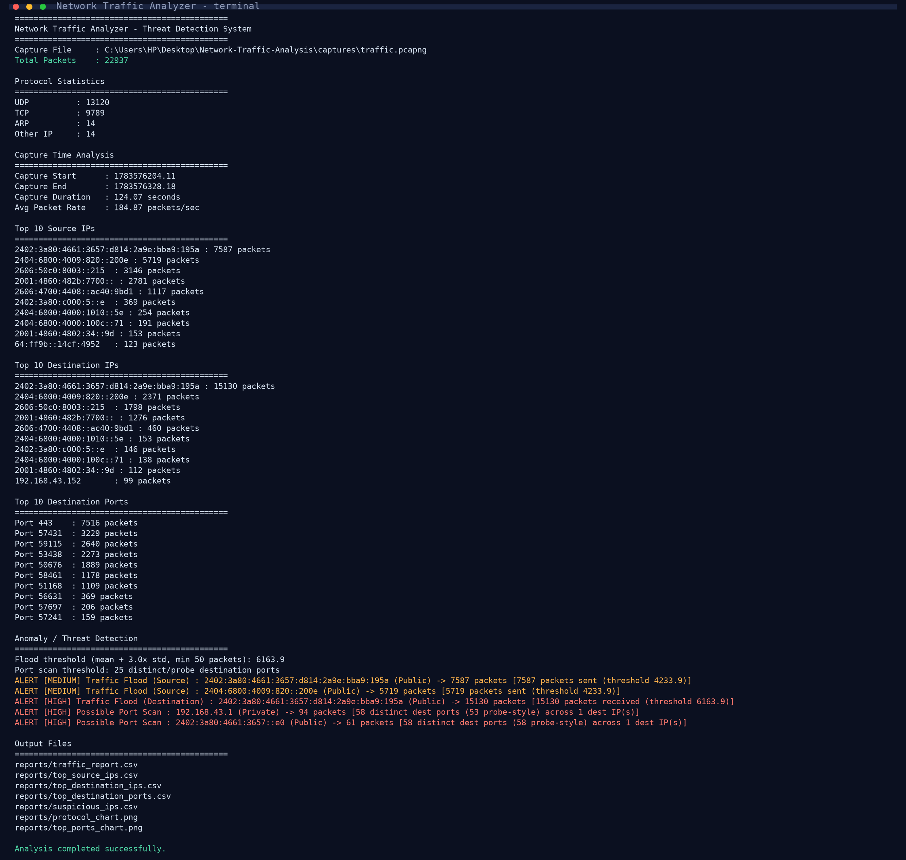

# 🛡️ Network Traffic Analyzer & Threat Detection System

> A Python-based cybersecurity project that analyzes captured network traffic (PCAP/PCAPNG) — it summarizes what happened on the network and flags suspicious behaviour for an analyst.

---

## 📑 Table of Contents

- [Overview](#overview)
- [Problem Statement](#problem-statement)
- [Features](#features)
- [Technologies Used](#technologies-used)
- [Project Structure](#project-structure)
- [Prerequisites & Installation](#prerequisites--installation)
- [How to Run](#how-to-run)
- [Step-by-Step Guide](#step-by-step-guide-from-zero-to-results)
- [Sample Terminal Output](#sample-terminal-output)
- [How It Works](#how-it-works)
- [Anomaly Detection Logic](#anomaly-detection-logic)
- [Output & Reports](#output--reports)
- [Sample Analysis Results](#sample-analysis-results)
- [Future Improvements](#future-improvements)
- [Developed By](#developed-by)

---

## 📌 Overview

The **Network Traffic Analyzer** reads packet capture files (from Wireshark) and extracts real network insights:

- **What** protocols are in use (TCP, UDP, ICMP, ARP…)
- **Who** talks to whom (top source / destination IPs)
- **Where** traffic is going (top destination ports)
- **When / how fast** traffic flows (capture duration, packets/sec)
- **What looks suspicious** (traffic floods, possible port scans)

It does all of this automatically and produces **CSV reports + PNG charts**, so a 22,000+ packet capture can be reviewed in seconds instead of hours.

---

## 🚨 Problem Statement

Modern networks generate thousands of packets every minute. Manually inspecting raw traffic is:

- ❌ **Slow** — 22,000+ packets in just 2 minutes
- ❌ **Error-prone** — humans miss patterns in huge data
- ❌ **Impractical** — attackers hide in the noise of normal traffic

**Solution:** an automated tool that summarizes traffic into one-page reports and applies statistical + heuristic detection to surface *potentially* malicious behaviour — leaving the final judgement to an analyst (the same model used by real SOC tools like Suricata/Zeek).

---

## 🚀 Features

- Analyze PCAP/PCAPNG files captured using Wireshark
- Count total network packets
- Protocol statistics (TCP, UDP, ICMP, ARP, other) with percentages
- **Full IPv4 and IPv6 support**
- Capture time analysis (duration, average packet rate)
- Top Source IP Analysis
- Top Destination IP Analysis
- Top Destination Port Analysis
- **Anomaly / threat detection:**
  - Traffic flood detection using a **dynamic statistical threshold** (mean + 3σ)
  - Port scan detection using a probe-style heuristic (many destination ports, few packets each)
  - Address classification (Private / Public / Link-local / Loopback) for context
  - Severity ratings (MEDIUM / HIGH) for every alert
- Generate CSV reports
- Generate visualization charts (protocol pie chart + top ports bar chart)
- **Web dashboard (Flask)** — upload a capture or run a demo, results in a dark-themed UI with live charts

---

## 🛠️ Technologies Used

| Technology    | Purpose                                   |
|---------------|-------------------------------------------|
| Python 3      | Core programming language                 |
| Scapy         | Packet parsing & dissection               |
| Pandas        | Data structuring & CSV report generation  |
| Matplotlib    | Charts and graphs                         |
| Wireshark     | Live network capture (PCAP file creation) |
| Flask         | Web dashboard                            |
| ipaddress     | IP classification (stdlib)                |

---

## 📂 Project Structure

```
Network-Traffic-Analysis/
│
├── captures/
│   └── traffic.pcapng              # Sample Wireshark capture (23k packets)
│
├── scripts/
│   ├── analyzer.py               # Core analysis & detection engine
│   └── make_screenshot.py        # Regenerates screenshots/terminal_output.png
│
├── reports/                        # Generated by analyzer.py (gitignored)
│   ├── traffic_report.csv
│   ├── top_source_ips.csv
│   ├── top_destination_ips.csv
│   ├── top_destination_ports.csv
│   ├── suspicious_ips.csv
│   ├── protocol_chart.png
│   └── top_ports_chart.png
│
├── app.py                          # Flask web dashboard
├── templates/                      # HTML pages (index, dashboard)
├── static/                         # CSS styling
├── uploads/                        # Temporary capture uploads (gitignored)
├── render.yaml                     # Render.com deployment config
├── test_web.py                     # Web dashboard smoke tests
├── run_analysis.bat                # One-click CLI run (Windows)
├── run_web.bat                     # One-click web dashboard (Windows)
├── screenshots/                    # Demo screenshot for README
├── README.md
└── requirements.txt
```

---

## 🔧 Prerequisites & Installation

**Prerequisites:**
- Python 3.8+

**Setup:**

```bash
git clone <repo-url>
cd Network-Traffic-Analysis

# Install dependencies
pip install -r requirements.txt

# Verify setup
python -c "from scapy.all import rdpcap; print('Scapy OK')"
```

`requirements.txt`:

```
scapy
pandas
matplotlib
flask
gunicorn
```

> `gunicorn` is only needed for the Render.com deployment — the app also runs fine locally without it.

> Wireshark is only needed for **creating** your own capture files — it is not required to run the analyzer.

---

## 🚀 How to Run

### CLI Analyzer

```bash
# From the project root — uses the sample capture by default
python scripts/analyzer.py

# Analyse a different capture file (run from anywhere)
python scripts/analyzer.py --capture captures/traffic.pcapng

# Custom top-N results
python scripts/analyzer.py --top 5

# Custom detection thresholds
python scripts/analyzer.py --scan-ports 15 --std-mult 2.5 --min-packets 100
```

### 🌐 Web Dashboard (Flask)

```bash
python app.py
# or one-click on Windows:
run_web.bat
```

Then open **http://127.0.0.1:5000** and either click **Run Demo** (uses the sample capture) or upload your own `.pcap` / `.pcapng` file. Results show live charts, protocol stats, top IPs/ports, and threat alerts in a dark-themed dashboard.

Server config is controlled via environment variables:

| Env Variable   | Default                             | Purpose                          |
|----------------|-------------------------------------|----------------------------------|
| `SECRET_KEY`   | `dev-secret-key-change-in-production` | Flask session signing key        |
| `FLASK_DEBUG`  | `0`                                 | `1` enables debug mode           |
| `HOST`         | `127.0.0.1`                         | Bind address                     |
| `PORT`         | `5000`                              | Port                             |

### CLI Options

| Argument        | Default                    | Description                                      |
|-----------------|----------------------------|--------------------------------------------------|
| `--capture`     | `captures/traffic.pcapng`  | Path to capture file (PCAP / PCAPNG)             |
| `--top`         | `10`                       | Number of top entries to display                 |
| `--scan-ports`  | `25`                       | Distinct ports to flag as a possible port scan   |
| `--std-mult`    | `3.0`                      | Std-dev multiplier for the flood threshold       |
| `--min-packets` | `50`                       | Minimum packets before flood detection applies   |

---

## 📋 Step-by-Step Guide (from zero to results)

1. **Install Python** — download Python 3.8+ from [python.org](https://www.python.org/downloads/). Tick *"Add Python to PATH"* while installing.
2. **Open a terminal** in the project folder:
   ```bash
   cd Network-Traffic-Analysis
   ```
3. **Install dependencies:**
   ```bash
   pip install -r requirements.txt
   ```
4. **Get a capture file** (choose either):
   - Use the included sample: `captures/traffic.pcapng` — no extra step needed, *or*
   - Make your own with Wireshark: start capture → browse the internet for a minute → stop and *Save As* `.pcapng` into the `captures/` folder.
5. **Run the analyzer:**
   ```bash
   python scripts/analyzer.py
   ```
   *Use your own capture:* `python scripts/analyzer.py --capture captures/my_capture.pcapng`
6. **Read the terminal output** — total packets, protocol statistics, top IPs/ports, time analysis, and any detected anomalies.
7. **Check the generated reports** in the `reports/` folder — 5 CSV files + 2 charts.
8. **(Optional) Customize detection:** adjust thresholds before running, e.g.
   ```bash
   python scripts/analyzer.py --scan-ports 15 --std-mult 2.5 --min-packets 100 --top 5
   ```

> After step 7, the analysis is complete — no further configuration is required for a first run.

---

## 🖥️ Sample Terminal Output

```
=============================================
Network Traffic Analyzer - Threat Detection System
=============================================
Capture File     : captures/traffic.pcapng
Total Packets    : 22937

Protocol Statistics
=============================================
UDP          : 13120
TCP          : 9789
ARP          : 14
Other IP     : 14

Capture Time Analysis
=============================================
Capture Start      : 1783576204.11
Capture End        : 1783576328.18
Capture Duration   : 124.07 seconds
Avg Packet Rate    : 184.87 packets/sec

Top 10 Source IPs
=============================================
...
Anomaly / Threat Detection
=============================================
Flood threshold (mean + 3.0x std, min 50 packets): 6163.9
Port scan threshold: 25 distinct/probe destination ports
ALERT [HIGH] Traffic Flood (Destination) : 2402:3a80:...:195a (Public) -> 15130 packets
ALERT [HIGH] Possible Port Scan : 192.168.43.1 (Private) -> 94 packets
...
Analysis completed successfully.
```

### Live Screenshot



---

## 🧠 How It Works

```
┌─────────────┐    ┌──────────────┐    ┌───────────────┐    ┌─────────────────┐    ┌──────────────┐
│ 1. Capture  │ →  │ 2. Parse     │ →  │ 3. Analyse    │ →  │ 4. Detect      │ →  │ 5. Report    │
│ (Wireshark) │    │ (Scapy)      │    │ protocols/IP/ │    │ floods & scans │    │ CSV + charts │
│  PCAP/NG    │    │  rdpcap      │    │  port/time    │    │ (statistical)  │    │  for review  │
└─────────────┘    └──────────────┘    └───────────────┘    └─────────────────┘    └──────────────┘
```

1. **Capture** — Wireshark saves live traffic as a `.pcapng` file.
2. **Parse** — Scapy's `rdpcap()` loads every packet into an in-memory object.
3. **Analyse** — counts protocols, source/destination IPs, destination ports, and capture timing (works for IPv4 **and** IPv6).
4. **Detect** — applies statistical and heuristic anomaly detection (details below).
5. **Report** — saves everything to CSV files + PNG charts for sharing and reproducibility.

---

## 🧮 Anomaly Detection Logic

### 1. Traffic Flood Detection

- Computes packet counts for every source and destination IP.
- The threshold is **dynamic**, not hard-coded:

```
threshold = mean(packet_counts) + (3 × std_dev(packet_counts))
```

- Any IP exceeding the threshold is flagged.
- **Severity:** `MEDIUM` if above threshold, `HIGH` if above 2× threshold.

### 2. Port Scan Detection

- For each source IP, tracks the **distinct destination ports** it contacts.
- Flagged when a source hits **N or more** distinct ports **with mostly 1–3 packets each** (probe-style behaviour) — the classic scan signature.
- N is configurable (`--scan-ports`, default 25).

### 3. Context & Verification

- Address class (Private / Public / Link-local) is attached to every alert.
- **Alerts are candidates, not convictions** — exactly like real SOC tools, an analyst verifies before acting. (A NAT router can briefly look like a scanner when relaying many short connections.)

---

## 📊 Output & Reports

| File                        | Contents                                     |
|-----------------------------|----------------------------------------------|
| `traffic_report.csv`        | Protocol-wise packet counts with percentages |
| `top_source_ips.csv`        | Most active source IPs                       |
| `top_destination_ips.csv`   | Most targeted destination IPs                |
| `top_destination_ports.csv` | Most used destination ports                  |
| `suspicious_ips.csv`        | All detected anomalies with severity         |
| `protocol_chart.png`        | Protocol distribution pie chart              |
| `top_ports_chart.png`       | Top ports bar chart                          |

**Sample `suspicious_ips.csv`:**

```
IP Address,Type,Packets,Threshold,Severity,Address Class,Detail
2402:3a80:...,Traffic Flood (Source),7587,4233.9,MEDIUM,Public,7587 packets sent
192.168.43.1,Possible Port Scan,94,25.0,HIGH,Private,58 distinct dest ports
```

---

## 📈 Sample Analysis Results

From the included `captures/traffic.pcapng` (a ~2-minute home capture):

- **22,937 packets** analysed in seconds
- **~98% IPv6** traffic (YouTube / Google CDN servers)
- **UDP 57.2% | TCP 42.7%** — heavy DNS + HTTPS workload
- **Port 443 (HTTPS)** dominates — 7,516 packets, typical encrypted browsing
- Detected **2 flood candidates** and **2 port-scan candidates**, each explained with context

---

## 🎯 Future Improvements

- Real-time packet capture & continuous monitoring
- Email / Slack alerting on anomaly detection
- User authentication & multi-user access for the dashboard
- Machine-learning based anomaly scoring
- Integration with threat-intelligence IP feeds (e.g., AlienVault OTX)

---

## 👨‍💻 Developed By

**Kirankumar Thakor** — 7th Semester, Information Technology  
**Domain:** Cyber Security

---

> 🎓 Prepared for the **Industrial Internship – Project Exhibition & Jury**, Engineers' Day, 17 September 2026.